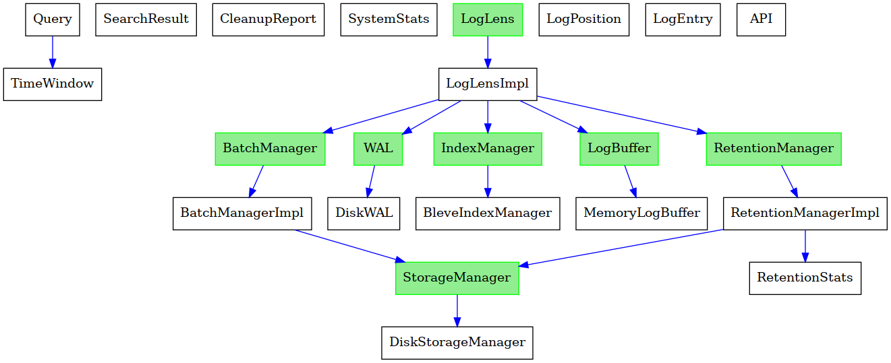

# Go Code Structure Visualizer

## Overview
This project is a Go code structure visualizer that analyzes Go source code to extract structs, interfaces, and their relationships. It then generates a visual representation of these relationships as a graph.



## Features
- Parses Go source code to identify:
  - Structs and their fields
  - Interfaces and their methods
  - Method implementations
  - Embedded struct dependencies
- Determines which structs implement which interfaces
- Generates a directed graph visualization of the relationships using Graphviz

## Dependencies
The project requires the following Python libraries:
- `tree_sitter` (for parsing Go code)
- `tree_sitter_go` (Go language grammar for `tree_sitter`)
- `pygraphviz` (for visualizing the structure graph)

You can install the required dependencies using:
```sh
pip install tree_sitter tree_sitter_go pygraphviz
```

## Usage
Run the script with the path to the Go source directory:
```sh
python main.py /path/to/go/project
```
This will analyze the Go project and generate a graph saved as `type-graph.png`.

## How It Works
1. **Code Parsing**: Uses `tree_sitter` to parse Go source files recursively from the given directory.
2. **Data Extraction**:
   - Extracts struct definitions, including fields and embedded structs.
   - Extracts interface definitions and methods.
   - Matches struct methods to interfaces to determine implementation relationships.
3. **Graph Generation**: Uses `pygraphviz` to create a directed graph:
   - Nodes represent structs and interfaces.
   - Edges represent struct dependencies and interface implementations.